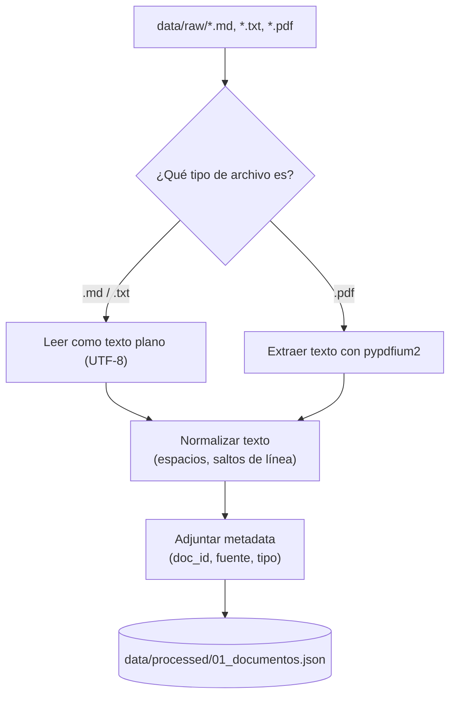

# 01 · Ingesta y preparación de documentos

## ¿Qué problema resuelve esta etapa?

Antes de poder "preguntarle" algo a nuestros documentos privados, necesitamos
convertirlos a un formato uniforme: **texto plano limpio**, sin importar si el
original es un `.md`, un `.txt` o un `.pdf` escaneado desde otra herramienta.

Esta etapa es la puerta de entrada de todo el pipeline RAG. Si la ingesta es
de mala calidad (texto cortado, caracteres extraños, tablas rotas), todo lo
que viene después (chunking, embeddings, respuestas) hereda ese problema.

## Flujo de la etapa



## Decisiones de diseño (y por qué)

- **Metadata desde el día 1**: cada documento guarda `doc_id`, `fuente` y
  `tipo`. En producción esto es lo que te permite luego decir "esta respuesta
  viene del manual de producto, sección X" en vez de un bloque de texto sin
  origen.
- **Normalización mínima y explícita**: solo colapsamos espacios y saltos de
  línea repetidos. Evitamos "limpiar de más" (por ejemplo, quitar acentos o
  mayúsculas) porque eso degrada la calidad semántica de los embeddings más
  adelante.
- **`pypdfium2` en vez de `PyPDF2`**: ambos ya están instalados en la máquina,
  pero `pypdfium2` (basado en el motor de Chromium) suele extraer texto con
  menos artefactos en PDFs con columnas o tablas.

## Cómo ejecutar

Este script forma parte del proyecto uv de la raíz (`s3/pyproject.toml`). Los
comandos se ejecutan desde `s3/`, no desde esta carpeta:

```bash
uv sync                                        # una sola vez, sincroniza dependencias
uv run python 01_ingesta_documentos/ingesta.py
```

Salida esperada:

```
Buscando documentos en: .../data/raw
[OK] 3 documento(s) ingeridos:
  - faq_interno.md (1632 caracteres)
  - manual_producto.md (2052 caracteres)
  - politica_soporte.md (1794 caracteres)

Guardado en: .../data/processed/01_documentos.json
```

## Validación

Ejecutado el `2026-09-03` en esta máquina (Python 3.12, Windows), primero con
`pip` y luego re-validado tras migrar el taller a `uv` (`uv sync` + `uv run`).
Salida real capturada de `uv run python 01_ingesta_documentos/ingesta.py`:

```
Buscando documentos en: C:\Users\User\Documents\workspace\clases-ia\s3\data\raw
[OK] 3 documento(s) ingeridos:
  - faq_interno.md (1632 caracteres)
  - manual_producto.md (2052 caracteres)
  - politica_soporte.md (1794 caracteres)

Guardado en: C:\Users\User\Documents\workspace\clases-ia\s3\data\processed\01_documentos.json
```

El script corrió sin errores en ambos gestores de dependencias y generó
`data/processed/01_documentos.json` con los 3 documentos de ejemplo de
`data/raw/`, cada uno con su texto limpio y metadata.

## Siguiente paso

Continuar con [`../02_chunking_contenido`](../02_chunking_contenido/README.md).

