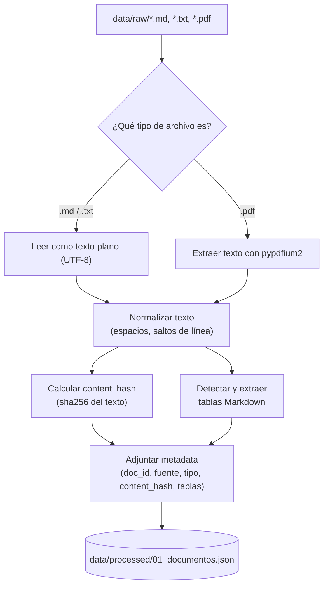

# 01 · Ingesta y preparación de documentos

## ¿Qué problema resuelve esta etapa?

Antes de poder "preguntarle" algo a nuestros documentos privados, necesitamos
convertirlos a un formato uniforme: **texto plano limpio**, sin importar si el
original es un `.md`, un `.txt` o un `.pdf` escaneado desde otra herramienta.

Esta etapa es la puerta de entrada de todo el pipeline RAG. Si la ingesta es
de mala calidad (texto cortado, caracteres extraños, tablas rotas), todo lo
que viene después (chunking, embeddings, respuestas) hereda ese problema.

## Flujo de la etapa



## Decisiones de diseño (y por qué)

- **Metadata desde el día 1**: cada documento guarda `doc_id`, `fuente` y
  `tipo`. En producción esto es lo que te permite luego decir "esta respuesta
  viene del manual de producto, sección X" en vez de un bloque de texto sin
  origen.
- **Normalización mínima y explícita**: solo colapsamos espacios y saltos de
  línea repetidos. Evitamos "limpiar de más" (por ejemplo, quitar acentos o
  mayúsculas) porque eso degrada la calidad semántica de los embeddings más
  adelante.
- **`pypdfium2` en vez de `PyPDF2`**: ambos ya están instalados en la máquina,
  pero `pypdfium2` (basado en el motor de Chromium) suele extraer texto con
  menos artefactos en PDFs con columnas o tablas.
- **`content_hash` (sha256 del texto limpio)**: permite detectar si un
  documento cambió desde la última ingesta sin comparar el texto completo —
  si el hash es igual, no hace falta reprocesar ni reindexar ese documento.
  Es exactamente el campo que la Lección 1 recomienda para deduplicación y
  para saber cuándo reindexar.
- **Tablas como estructura, no como texto plano**: aplanar una tabla a texto
  corrido le hace perder la relación fila-columna (un valor sin su
  encabezado es ambiguo — ver sección siguiente). Por eso se extraen aparte,
  preservando esa relación.

## Extracción de tablas

La Lección 1 explica por qué las tablas son especialmente difíciles: un
valor solo tiene sentido junto con su encabezado de columna y su etiqueta de
fila. Si se "aplana" a texto plano secuencial, esa relación se pierde.

Este taller no usa un framework pesado como Docling o `unstructured` (serían
overkill para documentos Markdown simples); en su lugar, `ingesta.py` detecta
tablas con sintaxis Markdown (`| encabezado | ... |` seguido de la fila
separadora `|---|---|`) y las devuelve en **dos formatos**, tal como sugiere
la lección:

```python
{
    "markdown": "| Plan | Almacenamiento | ... |\n|------|...|\n| Starter | 100 GB | ... |",
    "encabezados": ["Plan", "Almacenamiento", "Retención", "Regiones", "Cifrado"],
    "filas": [
        {"Plan": "Starter", "Almacenamiento": "100 GB", "Retención": "7 días", ...},
        {"Plan": "Business", "Almacenamiento": "1 TB", "Retención": "30 días", ...},
    ],
}
```

- **`markdown`** → se usa cuando el destino es el prompt de un LLM (etapa 4):
  compacto, y el modelo entiende tablas Markdown de forma nativa.
  `filas` → se usa para procesamiento programático (filtrar, sumar, exportar a
  otra herramienta).

Dos de los tres documentos de ejemplo ya contienen una tabla real: la de
planes en `manual_producto.md` y la de niveles de servicio (SLA) en
`politica_soporte.md`.

## Cómo ejecutar

Este script forma parte del proyecto uv de la raíz (`s3/pyproject.toml`). Los
comandos se ejecutan desde `s3/`, no desde esta carpeta:

```bash
uv sync                                        # una sola vez, sincroniza dependencias
uv run python 01_ingesta_documentos/ingesta.py
```

Salida esperada:

```
Buscando documentos en: .../data/raw
[OK] 3 documento(s) ingeridos:
  - faq_interno.md (1632 caracteres, hash=ab4dd68af9b4...)
  - manual_producto.md (2058 caracteres, hash=beb337b4aea5..., 1 tabla(s))
  - politica_soporte.md (1794 caracteres, hash=9feeeade89d2..., 1 tabla(s))

Guardado en: .../data/processed/01_documentos.json
```

## Validación

Ejecutado el `2026-09-03` en esta máquina (Python 3.12, Windows) con
`uv run python 01_ingesta_documentos/ingesta.py`. Salida real:

```
Buscando documentos en: C:\Users\User\Documents\workspace\clases-ia\s3\data\raw
[OK] 3 documento(s) ingeridos:
  - faq_interno.md (1632 caracteres, hash=ab4dd68af9b4...)
  - manual_producto.md (2058 caracteres, hash=beb337b4aea5..., 1 tabla(s))
  - politica_soporte.md (1794 caracteres, hash=9feeeade89d2..., 1 tabla(s))

Guardado en: C:\Users\User\Documents\workspace\clases-ia\s3\data\processed\01_documentos.json
```

Se inspeccionó manualmente `01_documentos.json` para confirmar que las 2
tablas detectadas quedaron bien parseadas — por ejemplo, la de
`manual_producto.md`:

```python
{'Plan': 'Enterprise', 'Almacenamiento': 'Ilimitado',
 'Retención': 'Hasta 365 días (configurable)', 'Regiones': 'Multi-región',
 'Cifrado': 'AES-256 + llaves propias (BYOK)'}
```

Cada fila quedó como un diccionario con las claves correctas (los
encabezados de columna), no como texto plano suelto — la relación
fila-columna que la Lección 1 marca como crítica se preservó correctamente.

## Siguiente paso

Continuar con [`../02_chunking_contenido`](../02_chunking_contenido/README.md).

