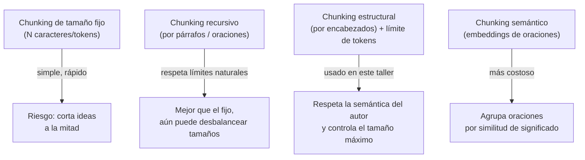
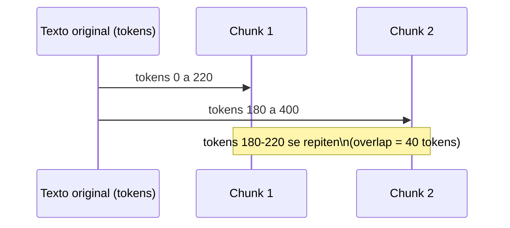

# 02 · Chunking para organizar y dividir el contenido

## ¿Por qué no vectorizar el documento completo?

Los modelos de embeddings tienen un límite de contexto y, más importante aún,
pierden precisión semántica cuando el texto es muy largo y mezcla varios
temas: el vector resultante termina siendo un "promedio difuso" de todo el
documento. Además, en la etapa de generación queremos inyectar en el prompt
**solo la información relevante**, no el manual completo.

La solución es el **chunking**: dividir cada documento en fragmentos pequeños
y coherentes, cada uno con su propio embedding.

## Estrategias de chunking (de más simple a más robusta)



Este taller implementa la opción **C**: primero se respeta la estructura que
el propio autor del documento ya definió (`## Encabezados`), y solo si una
sección resultante es muy larga, se subdivide por tokens con **overlap**
(solapamiento).

## ¿Para qué sirve el overlap (solapamiento)?

Si una idea queda justo en el borde entre dos chunks, el overlap asegura que
esa idea aparezca completa en al menos uno de los dos fragmentos, evitando
que la búsqueda posterior "pierda" información por un corte desafortunado.



## Parámetros usados

| Parámetro         | Valor | Razón                                                          |
|--------------------|-------|-----------------------------------------------------------------|
| `MAX_TOKENS`        | 220   | Suficiente para 1-2 párrafos; deja margen para varios chunks en el prompt final |
| `OVERLAP_TOKENS`    | 40    | ~18% de solapamiento, valor típico recomendado (10-20%)         |
| Tokenizador         | `tiktoken` (`cl100k_base`) | Mismo tokenizador de referencia usado por modelos tipo GPT/Claude; ya está instalado en la máquina |

## Cómo ejecutar

Este script forma parte del proyecto uv de la raíz (`s3/pyproject.toml`). Los
comandos se ejecutan desde `s3/`, no desde esta carpeta:

```bash
uv sync                                          # una sola vez, sincroniza dependencias
uv run python 02_chunking_contenido/chunking.py
```

## Validación

Ejecutado el `2026-09-03` sobre los 3 documentos de ejemplo generados por la
etapa 1, primero con `pip` y re-validado tras migrar el taller a `uv`. Salida
real capturada de `uv run python 02_chunking_contenido/chunking.py`:

```
[OK] 3 documento(s) -> 17 chunk(s)
  tokens por chunk -> min=8, max=152, promedio=87.1

Guardado en: C:\Users\User\Documents\workspace\clases-ia\s3\data\processed\02_chunks.json
```

Los 17 chunks quedan guardados con su `doc_id`, `fuente` y `n_tokens`, listos
para la siguiente etapa.

## Siguiente paso

Continuar con [`../03_embeddings_vectorstore`](../03_embeddings_vectorstore/README.md).
