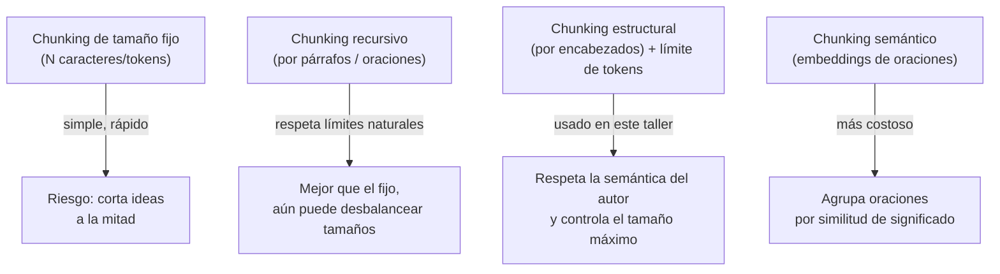
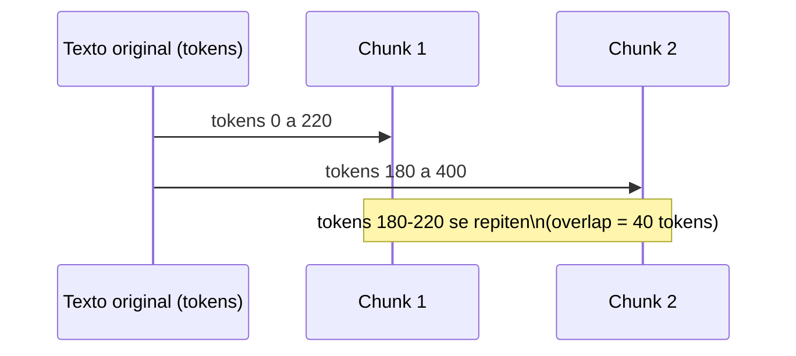
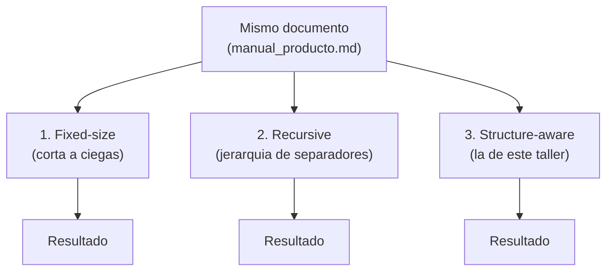

# 02 · Chunking para organizar y dividir el contenido

## ¿Por qué no vectorizar el documento completo?

Los modelos de embeddings tienen un límite de contexto y, más importante aún,
pierden precisión semántica cuando el texto es muy largo y mezcla varios
temas: el vector resultante termina siendo un "promedio difuso" de todo el
documento. Además, en la etapa de generación queremos inyectar en el prompt
**solo la información relevante**, no el manual completo.

La solución es el **chunking**: dividir cada documento en fragmentos pequeños
y coherentes, cada uno con su propio embedding.

## Estrategias de chunking (de más simple a más robusta)



Este taller implementa la opción **C**: primero se respeta la estructura que
el propio autor del documento ya definió (`## Encabezados`), y solo si una
sección resultante es muy larga, se subdivide por tokens con **overlap**
(solapamiento).

## ¿Para qué sirve el overlap (solapamiento)?

Si una idea queda justo en el borde entre dos chunks, el overlap asegura que
esa idea aparezca completa en al menos uno de los dos fragmentos, evitando
que la búsqueda posterior "pierda" información por un corte desafortunado.



## Parámetros usados

| Parámetro         | Valor | Razón                                                          |
|--------------------|-------|-----------------------------------------------------------------|
| `MAX_TOKENS`        | 220   | Suficiente para 1-2 párrafos; deja margen para varios chunks en el prompt final |
| `OVERLAP_TOKENS`    | 40    | ~18% de solapamiento, valor típico recomendado (10-20%)         |
| Tokenizador         | `tiktoken` (`cl100k_base`) | Mismo tokenizador de referencia usado por modelos tipo GPT/Claude; ya está instalado en la máquina |

## Extra: comparando las tres estrategias en la misma tabla

La Lección 2 (sección 3) describe fixed-size, recursive y structure-aware
como una escalera de "más simple" a "más robusto". `comparar_estrategias.py`
corre las tres sobre el **mismo documento** (`manual_producto.md`, que tiene
títulos, listas, prosa y una tabla) para verlo en números reales, no solo en
teoría.

Fixed-size y recursive son reimplementaciones livianas (no se agregó
LangChain como dependencia solo para esta comparación); structure-aware
reutiliza las funciones de `chunking.py`.



## Cómo ejecutar

Estos scripts forman parte del proyecto uv de la raíz (`s3/pyproject.toml`).
Los comandos se ejecutan desde `s3/`, no desde esta carpeta:

```bash
uv sync                                          # una sola vez, sincroniza dependencias
uv run python 02_chunking_contenido/chunking.py

# extra: comparar las 3 estrategias sobre el mismo documento
uv run python 02_chunking_contenido/comparar_estrategias.py
```

## Validación

Ejecutado el `2026-09-03` sobre los 3 documentos de ejemplo generados por la
etapa 1, primero con `pip` y re-validado tras migrar el taller a `uv`. Salida
real capturada de `uv run python 02_chunking_contenido/chunking.py`:

```
[OK] 3 documento(s) -> 17 chunk(s)
  tokens por chunk -> min=8, max=152, promedio=87.8

Guardado en: C:\Users\User\Documents\workspace\clases-ia\s3\data\processed\02_chunks.json
```

Los chunks quedan guardados con su `doc_id`, `fuente` y `n_tokens`, listos
para la siguiente etapa.

Salida real de `uv run python 02_chunking_contenido/comparar_estrategias.py`
(chunks de tamaño fijo/recursivo en 250 caracteres, structure-aware en 220
tokens — unidades distintas a propósito, para comparar cada una en su
configuración habitual):

```
Comparando estrategias sobre: manual_producto.md (2058 caracteres)

Estrategia                                                         #chunks  tabla intacta
------------------------------------------------------------------------------------------
1. Fixed-size (250 caracteres, overlap 30)                              10             SI
2. Recursive (250 caracteres, jerarquia de separadores)                 15  NO (se corto)
3. Structure-aware (220 tokens, overlap 40)                              7             SI
```

Resultado real, no el que "debería dar en teoría": con este documento y
estos tamaños, **recursive rompió la tabla de planes** (una fila terminó en
un chunk sin sus encabezados), mientras que fixed-size la mantuvo íntegra en
un chunk — pero por una razón poco confiable: el overlap del 12% hizo que,
por casualidad, una de las ventanas solapadas cubriera la tabla completa. Si
se corriera con otro `overlap` o `chunk_size`, fixed-size podría romperla
igual de fácil. La única estrategia que preserva la tabla **de forma
confiable y no accidental** es structure-aware: como la sección
"## 2. Planes disponibles" no tiene más contenido que la tabla, al cortar
por encabezados esa tabla queda automáticamente aislada en su propio chunk,
sin necesitar ninguna lógica especial para tablas.

Esto confirma en código lo que dice la Lección 2 (sección 6): cortar tablas
a ciegas es un riesgo real incluso con la estrategia "recomendada por
defecto" (recursive); solo una estrategia consciente de la estructura del
documento lo evita de forma sistemática.

## Siguiente paso

Continuar con [`../03_embeddings_vectorstore`](../03_embeddings_vectorstore/README.md).
