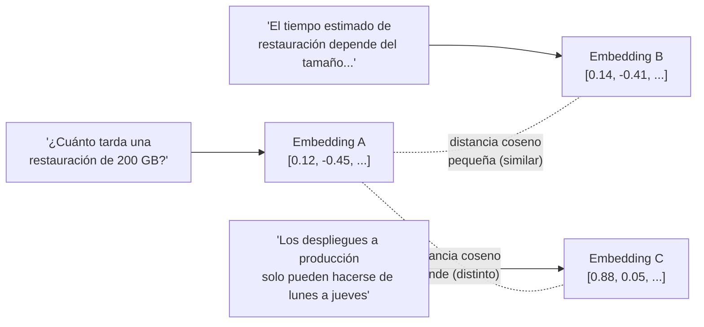
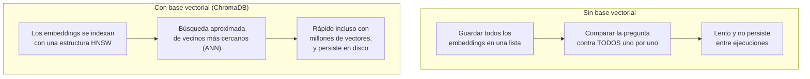

# 03 · Embeddings y almacenamiento en bases vectoriales

## ¿Qué es un embedding?

Un embedding es la representación numérica (un vector, ej. de 384 dimensiones)
del **significado** de un texto. Dos textos con significados parecidos
generan vectores "cercanos" en ese espacio, aunque usen palabras distintas.
Esto es lo que nos permite buscar por *significado* en vez de por coincidencia
exacta de palabras (como haría un `Ctrl+F`).



## ¿Por qué `sentence-transformers` para "vectorizar de manera fácil"?

- Corre **localmente**, sin necesitar una API key ni pagar por token.
- El modelo elegido, `paraphrase-multilingual-MiniLM-L12-v2`, es pequeño
  (~470 MB en disco, se descarga una sola vez) y soporta español de forma
  nativa, ideal para documentación interna en español.
- Una sola línea (`modelo.encode(textos)`) vectoriza una lista completa de
  chunks.

Alternativa en producción: embeddings vía API (OpenAI `text-embedding-3`,
Voyage AI, etc.), útiles cuando se necesita máxima calidad y no hay
restricción de enviar datos a un proveedor externo.

## ¿Por qué una base de datos vectorial (ChromaDB) y no una lista en memoria?



ChromaDB se eligió porque:
- Es **embebida** (no requiere levantar un servidor aparte, a diferencia de
  Qdrant o Weaviate en modo servidor).
- Persiste automáticamente en disco (`data/chroma_db/`) usando SQLite +
  índice HNSW internamente.
- Guarda el vector **y** el texto original **y** la metadata juntos, así el
  resultado de una búsqueda ya trae todo lo necesario para construir el
  prompt de la etapa 4.

## Cómo ejecutar

Este script forma parte del proyecto uv de la raíz (`s3/pyproject.toml`). Los
comandos se ejecutan desde `s3/`, no desde esta carpeta:

```bash
uv sync                                                              # una sola vez
uv run python 03_embeddings_vectorstore/embeddings_vectorstore.py
```

La primera ejecución descarga el modelo desde HuggingFace (requiere
internet); las siguientes usan la caché local y no vuelven a descargar nada.

## Validación

Ejecutado el `2026-09-03` en esta máquina, primero con `pip` y re-validado
tras migrar el taller a `uv`. Salida real capturada de
`uv run python 03_embeddings_vectorstore/embeddings_vectorstore.py`:

```
Cargando modelo de embeddings: sentence-transformers/paraphrase-multilingual-MiniLM-L12-v2
Warning: You are sending unauthenticated requests to the HF Hub. Please set a HF_TOKEN to enable higher rate limits and faster downloads.
Generando embeddings para 17 chunk(s)...
Dimension de cada embedding: 384
Guardando en ChromaDB (persistente) en: C:\Users\User\Documents\workspace\clases-ia\s3\data\chroma_db
[OK] 17 chunk(s) indexados en la coleccion 'technova_knowledge_base'
```

(El warning de "unauthenticated requests to the HF Hub" es informativo: solo
sugiere configurar un `HF_TOKEN` para límites de descarga más altos, no
afecta el resultado — el modelo se descarga igual de forma anónima.)

Se confirmó que `data/chroma_db/` quedó creado en disco con los 17 vectores
(384 dimensiones cada uno) y que el script es idempotente: correrlo de nuevo
recrea la colección sin duplicar chunks.

## Siguiente paso

Continuar con [`../04_busqueda_generacion`](../04_busqueda_generacion/README.md).
