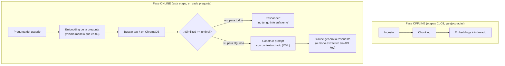
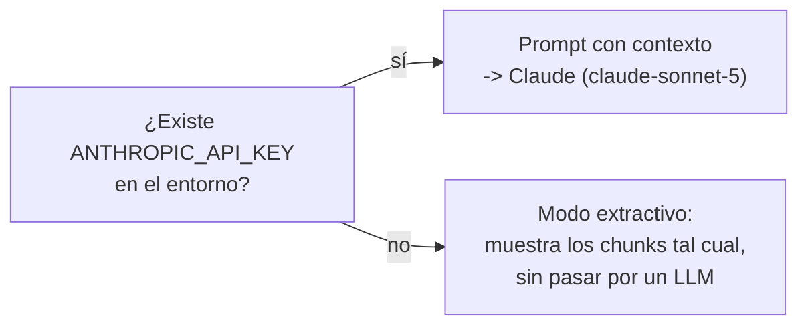

# 04 · Búsqueda por similitud y generación de respuestas con contexto

Esta es la etapa que cierra el pipeline: conecta la base vectorial (etapa 3)
con un LLM para producir una respuesta final fundamentada en los documentos
privados.

## Fase offline vs. fase online



La fase offline no tiene restricciones de latencia (se corre una vez por
documento). La fase online sí: cada paso agrega tiempo de espera para el
usuario que hizo la pregunta.

## Top-k y umbral de similitud

- **`TOP_K = 4`**: para una base de conocimiento pequeña como esta (17
  chunks), 3-5 candidatos es razonable. En un corpus grande, se recuperaría
  un `top-k` más amplio (20-100) como entrada a un paso de *re-ranking*
  (ver [`../05_tecnicas_avanzadas`](../05_tecnicas_avanzadas/README.md)).
- **`SIMILARITY_THRESHOLD = 0.15`**: con embeddings normalizados y espacio
  `cosine`, ChromaDB devuelve una *distancia* en vez de una similitud;
  `similitud = 1 - distancia`. Cualquier chunk por debajo del umbral se
  descarta **aunque haya entrado en el top-k**, porque probablemente no es
  relevante para la pregunta. Esto evita que el sistema "invente" contexto
  cuando la base de conocimiento simplemente no cubre lo preguntado.

## El prompt: etiquetas XML + instrucción anti-alucinación

```python
PROMPT_TEMPLATE = """Eres un asistente interno de TechNova S.A. que responde preguntas basándote únicamente en los documentos proporcionados.

<context>
{contexto}
</context>

Instrucciones:
- Responde la pregunta usando solo la información en <context>.
- Cita la fuente que respalda cada afirmación importante.
- Si el contexto no contiene información suficiente, dilo explícitamente. No inventes.

<question>
{pregunta}
</question>"""
```

La instrucción anti-alucinación ("si no sabés, decilo") es crítica: sin ella,
un LLM tiende a completar huecos con su conocimiento general de
preentrenamiento, lo que derrota el propósito de RAG (que la respuesta esté
anclada en los documentos privados, no en lo que el modelo "recuerda").

## Dos modos de generación



El modo extractivo existe para que puedas **validar la parte de retrieval**
(¿el sistema encuentra los fragmentos correctos?) sin necesitar una API key
ni incurrir en costo. Es también una buena forma de enseñar, en el taller,
que retrieval y generación son etapas separadas y depurables por separado
(la misma idea detrás de las métricas de RAGAS: un mal resultado puede venir
de un mal retrieval o de una mala generación, y son problemas distintos).

## Cómo ejecutar

Este script forma parte del proyecto uv de la raíz (`s3/pyproject.toml`). Los
comandos se ejecutan desde `s3/`, no desde esta carpeta:

```bash
uv sync   # una sola vez, sincroniza dependencias

# Modo extractivo (sin costo, no requiere API key)
uv run python 04_busqueda_generacion/rag_query.py "¿Cuál es el SLA para un incidente P1?"

# Modo con Claude (requiere una API key de Anthropic)
export ANTHROPIC_API_KEY=sk-ant-...        # Linux/Mac
$env:ANTHROPIC_API_KEY = "sk-ant-..."       # PowerShell
uv run python 04_busqueda_generacion/rag_query.py "¿Cuál es el SLA para un incidente P1?"
```

## Validación

Ejecutado el `2026-09-03` en esta máquina en modo extractivo (sin API key,
para validar retrieval sin costo), primero con `pip` y re-validado tras
migrar el taller a `uv`. No se probó el modo con Claude porque esta máquina
no tiene una `ANTHROPIC_API_KEY` configurada; el código del llamado al SDK
(`anthropic.Anthropic().messages.create(...)`) se verificó por separado
contra la versión instalada del SDK (`anthropic==1.3.0`), confirmando que
`Anthropic()` y `.messages.create` existen en esa versión.

**Pregunta dentro del dominio** — salida real de
`uv run python 04_busqueda_generacion/rag_query.py "¿Cuál es el SLA para un incidente P1?"`:

```
Pregunta: Cual es el SLA para un incidente P1?

Chunks recuperados (4, umbral de similitud=0.15):
  - politica_soporte.md (similitud=0.5650)
  - politica_soporte.md (similitud=0.4355)
  - politica_soporte.md (similitud=0.3766)
  - politica_soporte.md (similitud=0.3692)

Respuesta:
[Modo extractivo - sin LLM, no hay ANTHROPIC_API_KEY configurada]
Fragmentos mas relevantes encontrados:

1. (fuente: politica_soporte.md)
   ## 5. Política de reembolsos por incumplimiento de SLA
   Si TechNova incumple el SLA de un ticket P1, el cliente puede solicitar un
   crédito de servicio equivalente al 5% de la facturación mensual...

2. (fuente: politica_soporte.md)
   ## 3. Proceso de escalamiento
   ...Los incidentes P1 activan un canal de guerra ("war room")...

3. (fuente: politica_soporte.md)
   ## 2. Canales de contacto
   - Línea de guardia (on-call): exclusiva para incidentes P1, disponible 24/7...

4. (fuente: politica_soporte.md)
   ## 1. Niveles de servicio (SLA)
   | Prioridad | Descripción | Tiempo de primera respuesta | ... |
   | P1 | Servicio caído en producción | 15 minutos | ... |
```

Recuperó exactamente los 4 chunks de `politica_soporte.md` relevantes a la
pregunta (similitudes entre 0.37 y 0.57), incluyendo la tabla de SLA y la
política de reembolsos.

**Pregunta fuera del dominio** — salida real de
`uv run python 04_busqueda_generacion/rag_query.py "¿Cuál es la capital de Francia?"`:

```
Pregunta: Cual es la capital de Francia?

Chunks recuperados (0, umbral de similitud=0.15):

Respuesta:
No encontre informacion relevante en la base de conocimiento para responder esta pregunta.
```

Recuperó **0 chunks** (todos por debajo del umbral 0.15) y el sistema
respondió correctamente que no tiene información suficiente, en vez de
inventar una respuesta. Esto confirma que el umbral de similitud funciona
como red de seguridad anti-alucinación en la etapa de retrieval,
complementando la instrucción anti-alucinación del prompt.

## Siguiente paso (opcional, para profundizar)

Ver [`../05_tecnicas_avanzadas`](../05_tecnicas_avanzadas/README.md) para una
implementación práctica de **búsqueda híbrida (BM25 + vectorial)** y
**re-ranking con cross-encoder**, las dos técnicas que, según Anthropic,
más reducen la tasa de fallos de recuperación en sistemas RAG reales.
