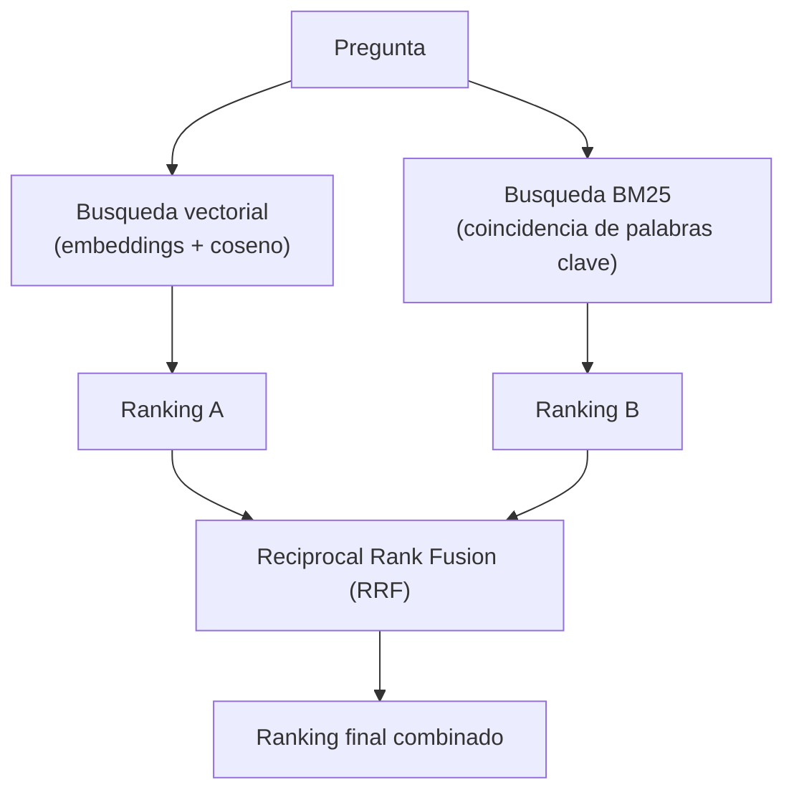
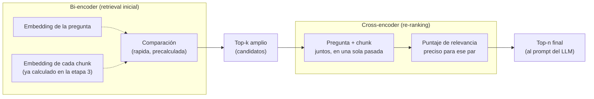

# 05 · Técnicas avanzadas (extra): búsqueda híbrida y re-ranking

Esta carpeta es opcional y va más allá de un pipeline RAG básico. Implementa
las dos técnicas que, combinadas, más reducen la tasa de fallos de
recuperación según los datos publicados por Anthropic en su investigación de
*Contextual Retrieval* (67% de reducción combinando embeddings contextuales +
BM25 + re-ranking, frente a búsqueda vectorial simple).

## ¿Por qué la búsqueda vectorial sola no siempre alcanza?

Un embedding representa el significado general de un texto. Es excelente
para preguntas conceptuales, pero le cuesta con **términos exactos poco
frecuentes**: códigos de producto, nombres propios, números de ticket. Dos
textos pueden ser semánticamente parecidos sin compartir ni una palabra, o
compartir una palabra clave crítica sin que eso se refleje con fuerza en la
similitud del vector.

## 1. Búsqueda híbrida (`hybrid_search.py`)

Combina, para la misma pregunta:

- **Búsqueda semántica** (vectorial, la misma de la etapa 4).
- **Búsqueda léxica BM25** (`rank_bm25`), que puntúa por coincidencia de
  palabras clave — el mismo principio detrás de los buscadores clásicos.



**Reciprocal Rank Fusion (RRF)** combina ambos rankings sin necesitar
normalizar puntajes de escalas distintas (un coseno entre 0 y 1 no es
comparable directamente con un puntaje BM25 sin acotar). La fórmula es
simple: cada documento recibe `1 / (k + posición)` por cada ranking en el
que aparece, y se suman esos aportes. `k=60` es la constante estándar usada
en la literatura.

```
score_rrf(doc) = Σ  1 / (k + posición_en_ranking_i)
                ranking i
```

## 2. Re-ranking con cross-encoder (`reranking.py`)



Un **bi-encoder** (lo usado en las etapas 3-4) vectoriza la pregunta y cada
chunk **por separado**, lo que permite precalcular los embeddings de los
chunks y comparar muy rápido. Un **cross-encoder** procesa pregunta y chunk
**juntos**, capturando interacciones finas entre ambos que un bi-encoder no
puede ver — pero es mucho más lento porque no se puede precalcular nada. Por
eso el patrón estándar es de dos etapas: recuperar un conjunto amplio con el
bi-encoder (rápido) y re-rankear solo esos pocos candidatos con el
cross-encoder (preciso).

Se usa `cross-encoder/mmarco-mMiniLMv2-L12-H384-v1`, una variante
multilingüe (incluye español) del cross-encoder estándar entrenado sobre
MS MARCO.

## Cómo ejecutar

Estos scripts forman parte del proyecto uv de la raíz (`s3/pyproject.toml`).
Los comandos se ejecutan desde `s3/`, no desde esta carpeta:

```bash
uv sync   # una sola vez, sincroniza dependencias

uv run python 05_tecnicas_avanzadas/hybrid_search.py "¿Cómo se instala el agente de NovaCloud Backup?"
uv run python 05_tecnicas_avanzadas/reranking.py "¿Cómo se instala el agente de NovaCloud Backup?"
```

Ambos scripts asumen que ya ejecutaste las etapas 01-03 (usan
`data/processed/02_chunks.json` y `data/chroma_db/`).

## Validación

Ejecutado el `2026-09-03` con la pregunta
`"¿Cómo se instala el agente de NovaCloud Backup?"`, primero con `pip` y
re-validado tras migrar el taller a `uv`.

Salida real de `uv run python 05_tecnicas_avanzadas/hybrid_search.py "..."`:

```
Pregunta: Como se instala el agente de NovaCloud Backup?

Top-10 BM25 (lexico):        ['manual_producto__003', 'manual_producto__004', 'manual_producto__000', 'faq_interno__003', 'manual_producto__001', 'manual_producto__005', 'faq_interno__001', 'faq_interno__002', 'politica_soporte__005', 'politica_soporte__003']
Top-10 vectorial (semantico): ['manual_producto__000', 'manual_producto__001', 'manual_producto__003', 'manual_producto__006', 'manual_producto__004', 'faq_interno__001', 'politica_soporte__002', 'manual_producto__005', 'faq_interno__000', 'politica_soporte__004']

Ranking fusionado (Reciprocal Rank Fusion):
  [0.0323] manual_producto__003 (manual_producto.md) -> ## 3. Instalación del agente  1. Descargar el agente `novacloud-agent` desde el portal interno. 2. E...
  [0.0323] manual_producto__000 (manual_producto.md) -> # Manual de Producto — NovaCloud Backup...
  [0.0315] manual_producto__004 (manual_producto.md) -> ## 4. Política de reintentos  Si un backup falla, el agente reintenta automáticamente hasta 3 veces ...
  [0.0315] manual_producto__001 (manual_producto.md) -> ## 1. Descripción general  NovaCloud Backup es el servicio interno de respaldo en la nube de TechNov...
  [0.0301] faq_interno__001 (faq_interno.md) -> ## Onboarding  **¿Cómo solicito accesos a los repositorios internos?** Debes crear un ticket en el p...
```

Salida real de `uv run python 05_tecnicas_avanzadas/reranking.py "..."`:

```
Pregunta: Como se instala el agente de NovaCloud Backup?

Candidatos iniciales (bi-encoder, top-8):
  - manual_producto__000 (manual_producto.md)
  - manual_producto__001 (manual_producto.md)
  - manual_producto__003 (manual_producto.md)
  - manual_producto__006 (manual_producto.md)
  - manual_producto__004 (manual_producto.md)
  - faq_interno__001 (faq_interno.md)
  - politica_soporte__002 (politica_soporte.md)
  - manual_producto__005 (manual_producto.md)

Despues de re-ranking con cross-encoder (top-3):
  [10.8634] manual_producto__003 (manual_producto.md) -> ## 3. Instalación del agente  1. Descargar el agente `novacloud-agent` desde el portal interno. 2. E...
  [0.3811] manual_producto__001 (manual_producto.md) -> ## 1. Descripción general  NovaCloud Backup es el servicio interno de respaldo en la nube de TechNov...
  [-0.2983] manual_producto__004 (manual_producto.md) -> ## 4. Política de reintentos  Si un backup falla, el agente reintenta automáticamente hasta 3 veces ...
```

Lectura de los resultados:

- **`hybrid_search.py`**: BM25 y la búsqueda vectorial coinciden en poner
  `manual_producto__003` ("## 3. Instalación del agente...") entre los
  primeros lugares; el ranking fusionado por RRF lo deja en el puesto #1
  con score 0.0323.
- **`reranking.py`**: de 8 candidatos iniciales recuperados por el
  bi-encoder, el cross-encoder le asigna a `manual_producto__003` un score
  de **10.86**, muy por encima del segundo lugar (0.38) — una separación
  mucho más nítida que la que da la similitud coseno del bi-encoder, que es
  justamente el punto de usar re-ranking.

Además, con la pregunta `"¿Qué pasa si un despliegue falla?"` (ver validación
end-to-end del pipeline completo) el cross-encoder demostró su valor de forma
aún más clara: RRF dejaba empatados en primer lugar a `faq_interno__002`
(la respuesta correcta, sobre despliegues) y `manual_producto__004` (sobre
reintentos de backup, un falso positivo por similitud léxica/semántica). El
cross-encoder separó ambos sin ambigüedad: `4.61` para el chunk correcto
contra `-1.09` para el falso positivo.

## Para seguir explorando (no implementado en este taller)

El material teórico de esta sesión (`04-busqueda-similitud-generacion.md`)
describe además:

- **Query rewriting / HyDE**: reformular la pregunta con un LLM antes de
  buscar.
- **RAG agéntico**: dejar que el LLM decida cuándo volver a buscar, con qué
  consulta, en un bucle iterativo.
- **Contextual Retrieval** (Anthropic): anteponer a cada chunk un resumen
  generado por LLM que lo sitúa en el documento completo, antes de indexarlo.
- **Evaluación con RAGAS**: métricas objetivas (`faithfulness`,
  `answer relevancy`, `context precision`, `context recall`) para medir si
  un cambio al pipeline lo mejoró o lo empeoró, en vez de juzgarlo "a ojo".

Son buenos siguientes pasos para extender este taller si el grupo quiere
profundizar más allá de las cuatro etapas base.
