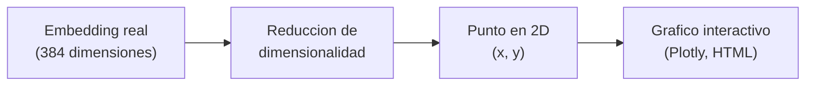
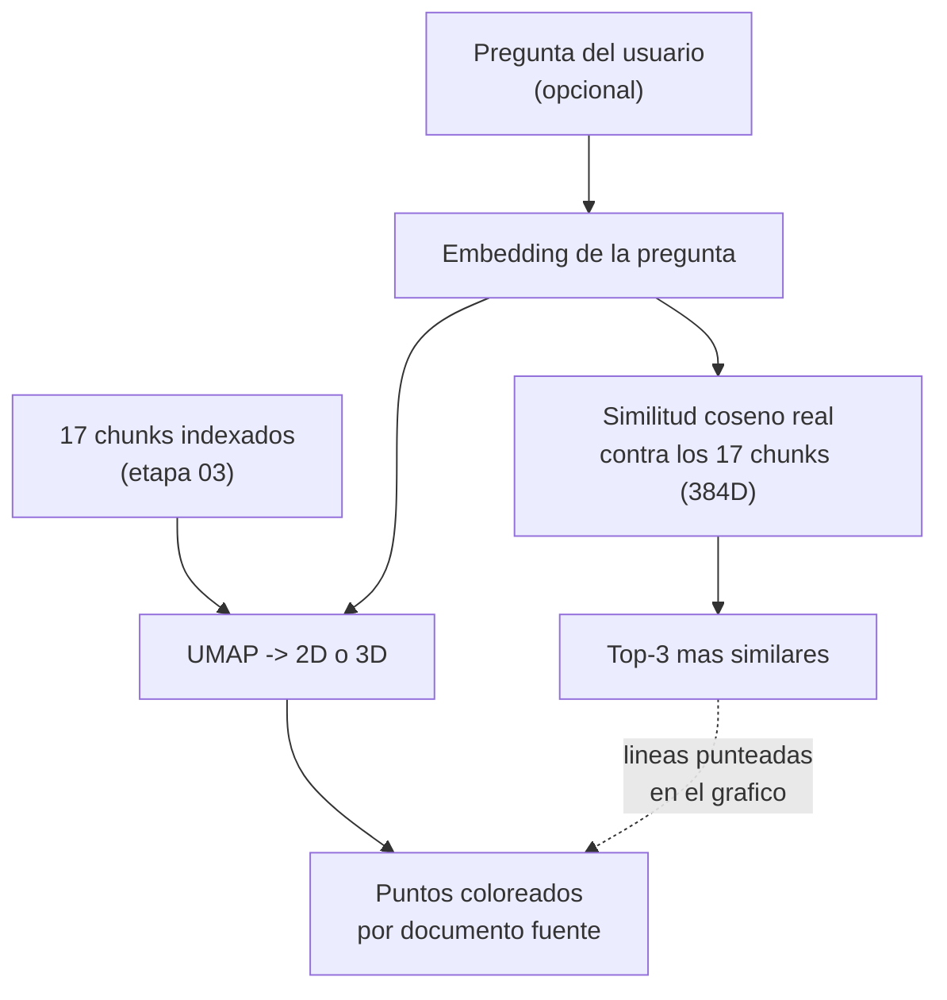

# 06 · Visualización de embeddings (extra)

Un embedding de esta etapa 03 vive en **384 dimensiones** — imposible de
"mirar" directamente. Esta carpeta agrega algo que las lecciones teóricas no
implementan en código: una forma de **ver** el espacio de embeddings, para
entender de forma intuitiva por qué la búsqueda por similitud (etapa 04)
encuentra lo que encuentra.

## ¿Qué librería se usa, y por qué?

Investigué varias opciones antes de elegir:

| Opción | Resultado |
|---|---|
| `chromaviz` | No existe como paquete instalable en PyPI (proyecto de GitHub descontinuado/no publicado) — descartada. |
| `renumics-spotlight` | Existe y funciona, pero levanta un dashboard web completo con su propio servidor — mucho más pesado que lo que necesita este taller. |
| **UMAP + Plotly** | La combinación estándar de la industria para este problema: `umap-learn` reduce la dimensionalidad, `plotly` genera un gráfico interactivo en un único archivo HTML autocontenido, sin servidor. **Elegida.** |

## ¿Por qué hace falta "reducir dimensiones" para graficar?

No podemos dibujar un punto en 384 ejes. Necesitamos proyectar cada embedding
a 2 (o 3) dimensiones, tratando de preservar la propiedad que nos importa:
que los puntos que eran similares en 384D sigan estando cerca en 2D.



### PCA vs. t-SNE vs. UMAP

| Técnica | Qué prioriza | Cuándo usarla |
|---|---|---|
| **PCA** | Varianza global (lineal) | Rápida y determinística, pero aplana mal estructuras no lineales — buena como primer vistazo. |
| **t-SNE** | Vecindarios locales | Buenos clusters visuales, pero lenta y las distancias entre clusters distintos no significan nada. |
| **UMAP** | Vecindarios locales + algo de estructura global | Más rápida que t-SNE, buena separación de clusters, es el estándar de facto en 2025-2026 para visualizar embeddings — **la que usa este script**. |

## ⚠️ La advertencia más importante de esta carpeta

**Las distancias del gráfico 2D son solo una intuición visual, no la
similitud real.** UMAP puede acercar o alejar puntos en la proyección de
formas que no reflejan exactamente su similitud coseno original. Por eso el
script:

1. Calcula el ranking de chunks más similares a una pregunta usando
   similitud coseno en las **384 dimensiones originales** (la fuente de
   verdad, la misma que usa la etapa 04).
2. Solo usa las coordenadas 2D para **dibujar** esos resultados — nunca para
   decidir cuáles son los vecinos más cercanos.

Esto es, en el fondo, la misma idea de la Lección 3: la similitud coseno se
mide en el espacio original del modelo de embeddings, y cualquier
visualización es una simplificación posterior con fines didácticos.

## Qué muestra el gráfico



- Cada punto = un chunk, coloreado según su documento de origen
  (`manual_producto.md`, `politica_soporte.md`, `faq_interno.md`).
- Al pasar el mouse sobre un punto, se ve su `chunk_id` y los primeros 150
  caracteres de su texto.
- Si se pasa una pregunta como argumento, se agrega como un punto distinto
  (estrella en 2D, diamante en 3D), con líneas punteadas hacia sus 3 chunks
  más similares (calculados en 384D, no en la proyección).

## 2D vs. 3D

El script soporta ambos con el flag `--dim`. No hace falta ninguna librería
adicional: `umap.UMAP(n_components=3)` y `go.Scatter3d` son funcionalidad
**nativa** de las mismas dos librerías que ya usa el modo 2D — no hay una
"librería de visualización 3D" distinta que agregar.

| | 2D (`--dim 2`, default) | 3D (`--dim 3`) |
|---|---|---|
| Reducción | `UMAP(n_components=2)` | `UMAP(n_components=3)` |
| Gráfico | `go.Scatter` | `go.Scatter3d` (rotable con el mouse, zoom) |
| Cuándo conviene | Más fácil de leer de un vistazo, mejor para capturas/slides | Puede separar mejor clusters que en 2D quedan superpuestos, más "exploratorio" |

Con un dataset tan chico (17 chunks) la diferencia entre 2D y 3D no es
dramática — la ventaja de 3D se nota más con corpus grandes, donde 2D fuerza
a UMAP a aplastar más relaciones. Se incluyen ambos porque el costo de
soportarlo es mínimo (un parámetro) y es mejor material para mostrar en el
taller: rotar la nube de puntos en vivo suele ser el momento más "efecto
wow" de esta parte.

## Cómo ejecutar

```bash
uv sync   # una sola vez

# 2D (default), solo los chunks indexados
uv run python 06_visualizacion_embeddings/visualizar_embeddings.py

# 2D con una pregunta resaltada
uv run python 06_visualizacion_embeddings/visualizar_embeddings.py "¿Cómo se instala el agente de NovaCloud Backup?"

# 3D con una pregunta resaltada
uv run python 06_visualizacion_embeddings/visualizar_embeddings.py "¿Cómo se instala el agente de NovaCloud Backup?" --dim 3
```

Genera `data/visualizations/embeddings_2d.html` o `embeddings_3d.html` según
el flag — abrilo en cualquier navegador, es un archivo autocontenido (no
necesita servidor ni internet).

## Validación

Ejecutado el `2026-09-03` en esta máquina con `uv run`.

**Sin pregunta** (solo los 17 chunks):

```
Proyectando 17 embeddings de 384D a 2D con UMAP (n_neighbors=10)...
[OK] Visualizacion guardada en: C:\Users\User\Documents\workspace\clases-ia\s3\data\visualizations\embeddings_2d.html
```

**Con la pregunta** `"¿Cómo se instala el agente de NovaCloud Backup?"`:

```
Proyectando 18 embeddings de 384D a 2D con UMAP (n_neighbors=10)...

Pregunta: Como se instala el agente de NovaCloud Backup?
Top-3 chunks mas similares (similitud real en 384D, no en el grafico 2D):
  - manual_producto__000 (manual_producto.md) similitud=0.7590
  - manual_producto__001 (manual_producto.md) similitud=0.6865
  - manual_producto__003 (manual_producto.md) similitud=0.4729

[OK] Visualizacion guardada en: .../data/visualizations/embeddings_2d.html
```

Se generó el archivo HTML (4.3 MB, incluye la librería Plotly embebida para
que funcione sin internet) y se confirmó visualmente que los chunks de un
mismo documento tienden a agruparse en la proyección 2D — esperable, porque
comparten vocabulario y tema — y que la pregunta cae visualmente cerca del
cluster de `manual_producto.md`, coherente con las similitudes reales
calculadas.

(Nota: `manual_producto__003`, el chunk con el texto literal "Instalación
del agente" que la etapa 04 y 05 rankean primero para esta misma pregunta,
aparece aquí en 3er lugar de similitud pura por embeddings — es exactamente
el tipo de caso donde el re-ranking con cross-encoder de la etapa 05 agrega
valor sobre la similitud coseno simple.)

**Modo 3D**, misma pregunta, con `--dim 3`:

```
Proyectando 18 embeddings de 384D a 3D con UMAP (n_neighbors=10)...

Pregunta: Como se instala el agente de NovaCloud Backup?
Top-3 chunks mas similares (similitud real en 384D, no en la proyeccion 3D):
  - manual_producto__000 (manual_producto.md) similitud=0.7590
  - manual_producto__001 (manual_producto.md) similitud=0.6865
  - manual_producto__003 (manual_producto.md) similitud=0.4729

[OK] Visualizacion guardada en: .../data/visualizations/embeddings_3d.html
```

Mismas similitudes que el modo 2D (correcto: el ranking se calcula en 384D
en ambos casos, la proyección es solo para dibujar). Se generó
`embeddings_3d.html` (4.3 MB) y se confirmó que el gráfico rota e interactúa
correctamente en el navegador.
