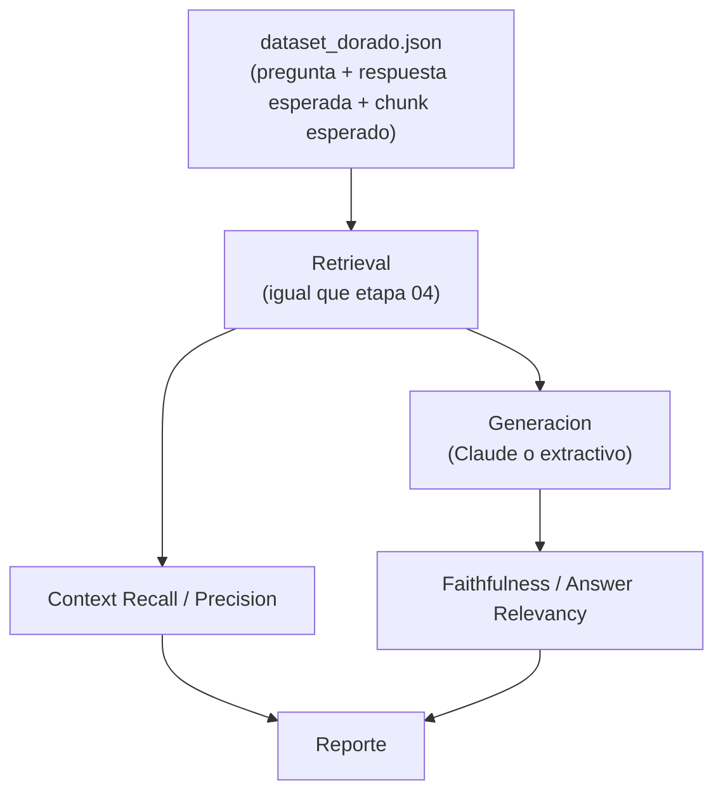

# 07 · Evaluación del pipeline con RAGAS (extra)

Construir un sistema RAG es solo la mitad del trabajo (Lección 4, sección
6): sin una forma objetiva de medir su calidad, no se puede saber si un
cambio al pipeline lo mejoró o lo empeoró. Esta carpeta agrega evaluación
con **RAGAS** (`pip install ragas`), separando la medición en las dos mitades
del pipeline: qué tan bueno fue el *retrieval*, y qué tan buena fue la
*generación* a partir de ese retrieval.

## Las 4 métricas (y qué etapa evalúan)

| Métrica | Qué mide | Etapa | Necesita LLM juez |
|---|---|---|---|
| **Context Recall** | De la información relevante que existía, ¿cuánta se recuperó? | Retrieval (03-04) | Sí (o una aproximación sin LLM) |
| **Context Precision** | De lo recuperado, ¿cuánto era realmente relevante? | Retrieval (03-04) | Sí (o una aproximación sin LLM) |
| **Faithfulness** | ¿Cada afirmación de la respuesta está respaldada por el contexto? | Generación (04) | Sí |
| **Answer Relevancy** | ¿La respuesta realmente contesta la pregunta? | Generación (04) | Sí |



Esta separación es la que vale la plata: una respuesta mala con **recall
bajo** es un problema de retrieval (el chunk correcto ni se recuperó, ningún
prompt lo iba a arreglar); una respuesta mala con buen recall pero
**faithfulness bajo** es un problema de generación (el contexto estaba, el
modelo no lo usó bien).

## El dataset dorado

`dataset_dorado.json` tiene 5 preguntas sobre los documentos de TechNova,
cada una con su respuesta esperada y el `chunk_id` que debería recuperarse.
Es deliberadamente chico (la Lección 4 recomienda "algunas decenas" en un
proyecto real; acá priorizamos que se pueda leer entero).

## Cómo se resolvió un conflicto de versiones real

Al instalar `ragas` con `uv add ragas`, la importación fallaba con:

```
ModuleNotFoundError: No module named 'langchain_community.chat_models.vertexai'
```

`ragas==0.4.3` importa ese submódulo de forma incondicional al cargar, pero
`langchain-community==0.4.2` (la versión más reciente en ese momento) ya lo
había removido. Se resolvió fijando una versión anterior compatible:
`uv add "langchain-community==0.3.31"`. Esto es exactamente el tipo de
conflicto que describe la Lección 3 sobre APIs que evolucionan rápido: los
conceptos (qué mide cada métrica) son estables, las versiones de librerías
no siempre lo son.

## Cómo se conecta RAGAS con Claude (sin usar OpenAI)

RAGAS por defecto asume OpenAI, pero soporta cualquier proveedor vía
`llm_factory`:

```python
from anthropic import Anthropic
from ragas.llms import llm_factory

llm = llm_factory("claude-sonnet-5", provider="anthropic", client=Anthropic())
```

Y para `Answer Relevancy` (que necesita embeddings además del LLM), se
reutiliza el **mismo modelo local** de la etapa 03 — no hace falta un
segundo proveedor de embeddings:

```python
from ragas.embeddings import HuggingfaceEmbeddings

embeddings = HuggingfaceEmbeddings(model_name="sentence-transformers/paraphrase-multilingual-MiniLM-L12-v2")
```

## Modo sin API key

Igual que la etapa 04, si no hay `ANTHROPIC_API_KEY`, el script no falla:
calcula una versión simplificada de Context Recall/Precision que compara
`chunk_id`s directamente (sin LLM, sin juzgar significado) y omite
faithfulness/answer relevancy con un mensaje explícito.

## Cómo ejecutar

```bash
uv sync   # una sola vez

# Modo sin API key (metricas de retrieval simplificadas)
uv run python 07_evaluacion_ragas/evaluar_ragas.py

# Modo completo (requiere ANTHROPIC_API_KEY)
export ANTHROPIC_API_KEY=sk-ant-...
uv run python 07_evaluacion_ragas/evaluar_ragas.py
```

## Validación

Ejecutado el `2026-09-03` en esta máquina, **modo sin API key**:

```
Dataset dorado: 5 preguntas

ANTHROPIC_API_KEY no configurada: se muestran solo metricas de
retrieval simplificadas (sin LLM). Faithfulness y Answer Relevancy
requieren un LLM como juez y se omiten.

- ¿Cuál es el SLA de tiempo de resolución para un incidente P1?
    context_recall_simple=1.00  context_precision_simple=0.25
- ¿Cómo se instala el agente de NovaCloud Backup?
    context_recall_simple=1.00  context_precision_simple=0.25
- ¿Cuál es la ventana de despliegue permitida a producción?
    context_recall_simple=1.00  context_precision_simple=0.25
- ¿Cuántos días de retención tiene el plan Business de NovaCloud Backup?
    context_recall_simple=0.00  context_precision_simple=0.00
- ¿Qué crédito de servicio puede solicitar un cliente si TechNova incumple el SLA de un ticket P1?
    context_recall_simple=1.00  context_precision_simple=0.25

Promedio -> context_recall_simple=0.80  context_precision_simple=0.20
```

**Esto no es un resultado "de juguete" — encontró una falla real del
pipeline.** La pregunta sobre el plan Business falló: el chunk correcto
(`manual_producto__002`, la tabla de planes) no apareció ni en el top-4 de
la búsqueda vectorial pura:

```
manual_producto__000  similitud=0.5968
manual_producto__004  similitud=0.5514
manual_producto__001  similitud=0.5216
politica_soporte__004 similitud=0.5201
```

**Por qué pasa esto:** el contenido de ese chunk es una tabla Markdown
(`| Business | 1 TB | 30 días | ... |`), no prosa natural. Un modelo de
embeddings general entrena principalmente con lenguaje natural, así que el
embedding de una fila de tabla no queda tan cerca semánticamente de una
pregunta en lenguaje natural como sí lo estaría un párrafo narrativo
equivalente — exactamente el punto débil de la búsqueda semántica pura que
describe la Lección 4 (sección 3.1).

**La búsqueda híbrida de la etapa 05 sí lo rescata**: corriendo
`hybrid_search.py` con la misma pregunta, `manual_producto__002` aparece en
el top-10 tanto de BM25 (posición 5, porque "Business" y "días" matchean
literalmente) como del vectorial (posición 7), y entra al ranking final
fusionado por RRF. La combinación de un `top-k` más amplio (10 en vez de 4)
más la señal léxica de BM25 recupera lo que la búsqueda vectorial angosta
por sí sola no encontraba — un caso real, no hipotético, de por qué la
Lección 4 recomienda búsqueda híbrida en vez de solo similitud coseno.

El modo completo con Claude (`faithfulness`, `answer_relevancy`,
`context_precision`/`context_recall` "reales", basados en juicio del LLM en
vez de comparación de IDs) está implementado pero **no se validó en esta
corrida** porque requiere gastar llamadas reales a la API de Anthropic.

## Siguiente paso

Ver [`../08_hyde`](../08_hyde/README.md) para la última técnica avanzada de
la Lección 4 cubierta en este taller.
