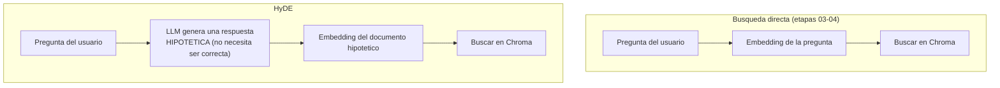

# 08 · HyDE — Hypothetical Document Embeddings (extra)

Última técnica avanzada de la Lección 4 (sección 5.2) cubierta en este
taller.

## El problema que resuelve

Una pregunta y su respuesta tienen "formas" de embedding distintas. La
pregunta `"¿cuál es la política de reembolsos?"` es corta, interrogativa, en
segunda persona implícita. El párrafo que la responde es afirmativo,
técnico, en tercera persona. Aunque hablen de lo mismo, un modelo de
embeddings puede no acercarlos tanto como uno esperaría, simplemente porque
son *tipos de texto* distintos.

## La idea de HyDE



En vez de vectorizar la pregunta, HyDE le pide a un LLM que **invente** una
respuesta plausible (con el vocabulario y la forma de un fragmento de
documentación real, aunque el contenido específico no sea necesariamente
correcto) y vectoriza *esa* respuesta hipotética. La intuición: ese texto
inventado se parece, en vocabulario y estructura, mucho más a los
documentos reales que contienen la respuesta verdadera de lo que se parece
la pregunta original.

## Por qué esta etapa no tiene "modo sin LLM"

Todas las demás etapas de este taller ofrecen un fallback quirúrgico sin
API key (modo extractivo en la 04, métricas simplificadas en la 07). Acá no
existe un fallback razonable: **HyDE es, por definición, generar un
documento con un LLM antes de buscar** — sin LLM no hay HyDE, solo búsqueda
directa. El script sigue corriendo sin `ANTHROPIC_API_KEY` (muestra la
búsqueda directa), pero no puede mostrar el lado HyDE de la comparación.

## El caso de prueba pendiente

La etapa 07 encontró una falla real de retrieval: para la pregunta
`"¿Cuántos días de retención tiene el plan Business de NovaCloud Backup?"`,
la búsqueda directa **no recupera** `manual_producto__002` (la tabla de
planes) ni en el top-4:

```
manual_producto__000  similitud=0.5968
manual_producto__004  similitud=0.5514
manual_producto__001  similitud=0.5216
politica_soporte__004 similitud=0.5201
```

Esta es exactamente la pregunta con la que vale la pena probar HyDE: un
documento hipotético bien generado ("El plan Business de NovaCloud Backup
incluye 1 TB de almacenamiento con una retención de 30 días...") debería
parecerse mucho más, en vocabulario, a la fila real de la tabla que la
pregunta original — es plausible que HyDE recupere el chunk correcto donde
la búsqueda directa no pudo. **No se validó todavía** porque requiere una
llamada real a Claude.

## Cómo ejecutar

```bash
uv sync   # una sola vez

export ANTHROPIC_API_KEY=sk-ant-...
uv run python 08_hyde/hyde_search.py "¿Cuántos días de retención tiene el plan Business de NovaCloud Backup?"
```

## Validación

Ejecutado el `2026-09-03` en esta máquina **sin** `ANTHROPIC_API_KEY`:

```
Pregunta: Cuantos dias de retencion tiene el plan Business de NovaCloud Backup?

Busqueda directa (embedding de la pregunta):
  - manual_producto__000 (manual_producto.md) similitud=0.5968
  - manual_producto__004 (manual_producto.md) similitud=0.5514
  - manual_producto__001 (manual_producto.md) similitud=0.5216
  - politica_soporte__004 (politica_soporte.md) similitud=0.5201

ANTHROPIC_API_KEY no configurada: HyDE requiere un LLM para generar
el documento hipotetico, no tiene un modo sin LLM razonable (a diferencia
de las otras etapas de este taller). No se puede comparar contra HyDE
sin una API key.
```

Confirma que la búsqueda directa por sí sola falla en este caso (mismo
resultado que documentó la etapa 07) y que el script maneja correctamente
la ausencia de API key sin romperse. **El lado HyDE de la comparación queda
pendiente** de una API key real para validarse.
