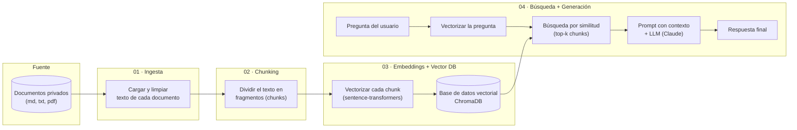

# Sesión 3 — RAG y conocimiento privado

Material práctico del taller: cómo construir un pipeline de **Retrieval-Augmented
Generation (RAG)** de punta a punta usando documentación interna ficticia de
"TechNova S.A." como caso de estudio.

Este material es el complemento práctico de las 4 lecciones teóricas de la
sesión (ingesta, chunking, embeddings/bases vectoriales, y búsqueda +
generación). Cada carpeta numerada corresponde a una lección e implementa,
con código real y validado, las técnicas centrales que esa lección describe.

Todo el código de este taller es funcional y fue validado en esta misma máquina
(ver la sección "Validación" en cada carpeta).

## Arquitectura general



## Estructura de carpetas

```
s3/
├── pyproject.toml   → manifiesto uv (única fuente de dependencias del taller)
├── uv.lock          → versiones exactas resueltas por uv
├── data/
│   ├── raw/         → documentos privados de ejemplo (fuente de verdad)
│   └── processed/   → salidas intermedias del pipeline (JSON)
├── 01_ingesta_documentos/
├── 02_chunking_contenido/
├── 03_embeddings_vectorstore/
├── 04_busqueda_generacion/
├── 05_tecnicas_avanzadas/         → extra: búsqueda híbrida (BM25) + re-ranking
├── 06_visualizacion_embeddings/   → extra: gráfico interactivo de los embeddings (UMAP + Plotly)
├── 07_evaluacion_ragas/           → extra: evaluación del pipeline con RAGAS
└── 08_hyde/                       → extra: HyDE (respuesta hipotética antes de buscar)
```

Cada carpeta numerada corresponde a una etapa del pipeline y contiene:

- `README.md` → teoría, diagrama Mermaid y guía paso a paso.
- uno o más scripts `.py` ejecutables de forma independiente.

Las dependencias de **todas** las etapas viven en un único `pyproject.toml`
en la raíz, gestionado con **uv** (no hay `requirements.txt` ni `pip install`
en este proyecto). Las etapas están pensadas para ejecutarse **en orden**,
porque cada una lee la salida de la anterior desde `data/processed/`.

## Cómo ejecutar todo el pipeline

Todos los comandos se corren desde la raíz `s3/` (donde está `pyproject.toml`).
`uv` crea y gestiona el entorno virtual automáticamente — no hace falta crear
uno a mano.

```bash
# sincroniza el entorno con las dependencias de pyproject.toml / uv.lock
uv sync

# ejecutar cada etapa en orden
uv run python 01_ingesta_documentos/ingesta.py
uv run python 02_chunking_contenido/chunking.py
uv run python 03_embeddings_vectorstore/embeddings_vectorstore.py
uv run python 04_busqueda_generacion/rag_query.py "¿Cuál es el SLA para un incidente P1?"

# opcional: búsqueda híbrida + re-ranking (ver 05_tecnicas_avanzadas/README.md)
uv run python 05_tecnicas_avanzadas/hybrid_search.py "¿Cómo se instala el agente de NovaCloud Backup?"
uv run python 05_tecnicas_avanzadas/reranking.py "¿Cómo se instala el agente de NovaCloud Backup?"

# opcional: visualizar los embeddings en 2D o 3D (ver 06_visualizacion_embeddings/README.md)
uv run python 06_visualizacion_embeddings/visualizar_embeddings.py "¿Cómo se instala el agente de NovaCloud Backup?" --dim 3

# opcional: evaluar el pipeline con RAGAS (ver 07_evaluacion_ragas/README.md)
uv run python 07_evaluacion_ragas/evaluar_ragas.py

# opcional: HyDE, requiere ANTHROPIC_API_KEY (ver 08_hyde/README.md)
uv run python 08_hyde/hyde_search.py "¿Cuántos días de retención tiene el plan Business de NovaCloud Backup?"
```

Si necesitás agregar una dependencia nueva más adelante, usá `uv add <paquete>`
en vez de `pip install` — así queda registrada en `pyproject.toml` y fijada en
`uv.lock` para que el taller siga siendo reproducible.

> **Nota (Windows/PowerShell):** si ves caracteres extraños con tildes en la
> consola, es solo un problema de visualización del terminal (code page).
> Corré `chcp 65001` antes, o antepone `$env:PYTHONIOENCODING="utf-8";` a los
> comandos — el contenido de los archivos generados siempre es UTF-8 correcto.

## Sobre el LLM usado (etapas 04, 07 y 08)

Estas tres etapas usan la API de **Anthropic (Claude)**. Sin una
`ANTHROPIC_API_KEY` configurada:

- **Etapa 04**: cae a un modo **extractivo** (sin LLM) que arma la respuesta
  directamente con los fragmentos recuperados — permite validar el
  *retrieval* sin costo.
- **Etapa 07 (RAGAS)**: calcula solo métricas de retrieval simplificadas
  (sin LLM); `faithfulness` y `answer_relevancy` se omiten.
- **Etapa 08 (HyDE)**: solo puede mostrar la búsqueda directa; el lado HyDE
  de la comparación no tiene un modo sin LLM razonable (HyDE *es* el uso del
  LLM), así que queda pendiente de validar con una key real.

Todo lo demás (etapas 01, 02, 03, 05 y 06) es 100% local, sin ninguna API
externa de pago.
